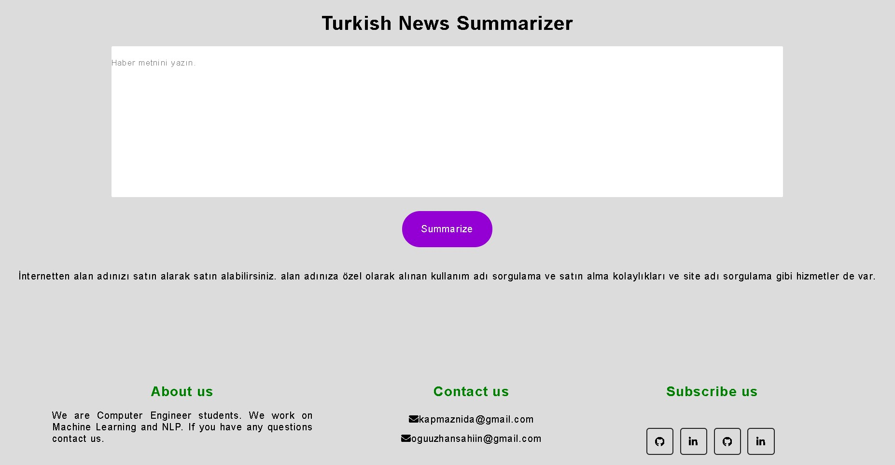

# Turkish Abstractive Text Summarization

  

## Abstract

Text summarization can be defined as “is the task of producing a concise and fluent summary while preserving key information content and overall meaning”. There are bunch of studies about this task. Most of them are in English. We aimed to create a Turkish abstractive text summarization pipeline from scratch (Crawler to deployment). 

## Work Plan

Equal Contribution

| Action                     | Oguzhan Sahin | Nida Kapmaz | 
|----------------------------|---------------|-------------|
| Crawler                    |       x       |      x      |
| Scraping                   |               |      x      |
| Data Preprocessing         |       x       |      x      |
| Labelling                  |               |      x      |
| Encoder-Decoder Model      |       x       |             |
| Flask                      |       x       |      x      |    
| Deployment                 |       x       |             | 

## Pipeline

- Crawler
  - Web crawling is a component of web scraping, the crawler logic finds URLs to be processed by the scraper code.
  - Used Scrapy library for this task.
  - Built Scrapy crawler for Webtekno.com and collected about 18k news links.
- Scraping
- Labelling
- Model
- Flask
