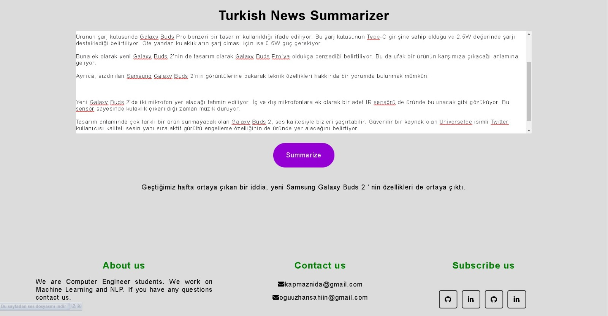
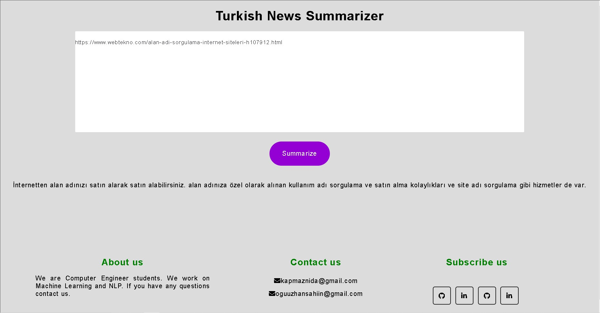

# Turkish Abstractive Text Summarization
<p align="center">
  
</p>


## Abstract

Text summarization can be defined as “is the task of producing a concise and fluent summary while preserving key information content and overall meaning”. There are bunch of studies about this task. Most of them are in English. We aimed to create a Turkish abstractive text summarization pipeline from scratch (Crawler to deployment). 

## Work Plan

Equal Contribution

| Action                     | Oguzhan Sahin | Nida Kapmaz | 
|----------------------------|---------------|-------------|
| Crawler                    |       x       |      x      |
| Scraping                   |               |      x      |
| Data Preprocessing         |       x       |      x      |
| Labelling                  |               |      x      |
| Encoder-Decoder Model      |       x       |             |
| Flask                      |       x       |      x      |    
| Deployment                 |       x       |             | 


## Pipeline

- Crawler
  - Web crawling is a component of web scraping, the crawler logic finds URLs to be processed by the scraper code.
  - Used Scrapy library for this task.
  - Built Scrapy crawler for Webtekno.com and collected about 18k news links.
- Scraping
  - Scraped news text by using links that is obtained from crawler.
  - Reques and bs4 libraries used for this task.
- Labelling
   - Since text summarization task is supervised, the news needed to be labelled (summarized).
   - Extracted summary for every single article by using TF-IDF method.
- Model
  - Fine-tuned BERT model for this task for 3 epoch.
- Flask
  - Created HTML, CSS files for this task.
  - Created UI by implementing our model to these html files.
- Deployment
  - As a future work, Heroku or Streamlit will be used.

## How to run?

- If you do not have data, you can run crawler first. In scrapy_crawlers/spiders/, run below script:

```
scrapy crawl webtekno --logfile webktekno.log -o webtekno.json -t jsonlines
```
- Once you run this script, you will have 2 files (webtekno.log, webtekno.json). In webtekno.json, you will have urls. If you change the urls, you need to adjust webtekno.py.

- In scrapy_crawler/spiders/, there is parse_json.py for parsing json files and gives an .csv files as an output.

- To get new text, scraping.py takes an input urls csv, and return urls and text csv file.

- tf_idf.py here will be used for labelling news text.

- Once you prepare your data for fine-tuning, you can run fine-tune.ipynb noteboook.

## Results

<p align="center">
  
  
</p>


This repository is created by [Oguzhan Sahin](https://github.com/oguuzhansahin) and [Nida Kapmaz](https://github.com/kapmaznida)
